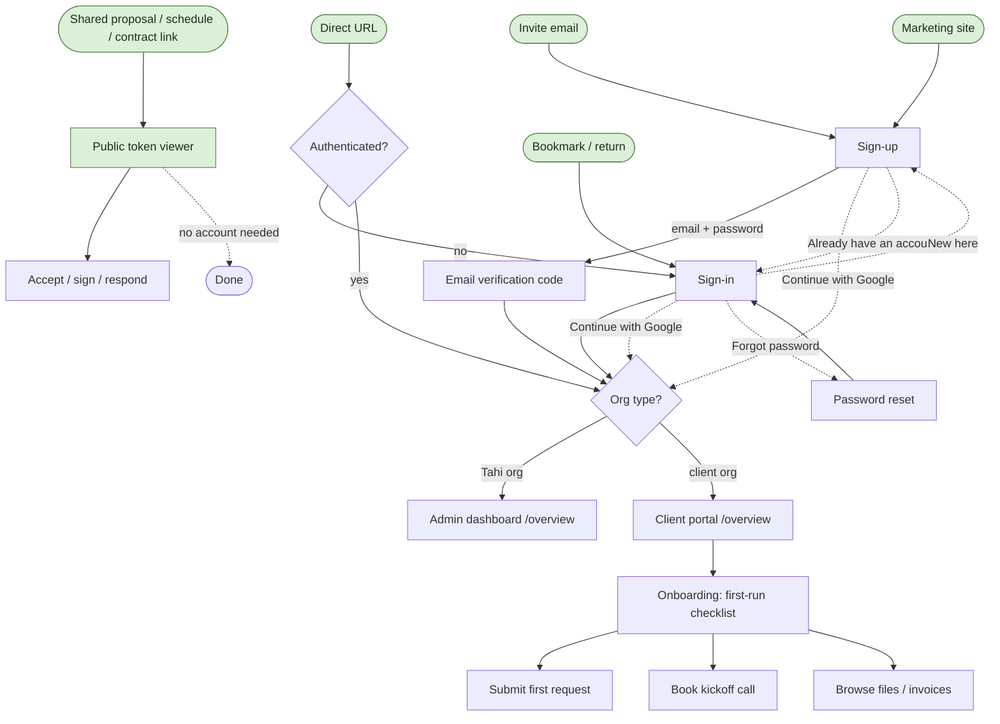

# Tahi Dashboard - Experience Atlas

> Companion to `DASHBOARD_MAP.md`. The map is the **engineering** reference (what each page does, its APIs, tables, status). This is the **experience** reference: what each page looks like, how it behaves, how users move through it, and why. A designer or PM should be able to open this and make informed decisions without reading code.
>
> **Living document.** It is seeded with the Auth + Onboarding UI shift. Every new page (or redesign) gets added here in the same per-page format as it is built. Documenting a surface here is part of "done" for any UI work.
>
> Last updated: 2026-06-27. House rule: no em or en dashes, only hyphens.

---

## How to read this

Every page is one block with the same seven parts:

1. **Purpose & job** - why the page exists and the one job it does.
2. **Who arrives & from where** - the entry points, per persona.
3. **Anatomy** - the layout zones and what is on screen (the "what it looks like").
4. **Interactions & states** - behaviours and every state (default, focus, loading, error, empty, success).
5. **Where they go next** - every exit and CTA, and where it leads.
6. **The why** - the UX rationale.
7. **The how** - route, key components, data, auth (the technical layer).

**Coverage status** per page: 🟢 built and live · 🟡 in design / partially built · ⚪ planned.

Flows are written as **Mermaid** diagrams (they render on GitHub, VS Code, and most markdown viewers, and export to SVG/PNG).

---

## Personas & entry points

| Persona | Mindset | Enters via | First page | Goal | Leaves to |
|---|---|---|---|---|---|
| **New client** (high-ticket, just signed) | Evaluating, seeking reassurance they chose right | Personalised invite link | `Sign-up` | Create account, see what they bought | Client portal overview |
| **Returning client** | Task-focused, time-pressed | Bookmark / email link | `Sign-in` | Get back to their project fast | Client portal overview |
| **Tahi team member** | Pure utility | Direct URL | `Sign-in` | Authenticate and get to work | Admin dashboard |
| **Prospect / public** | Curious, comparing | Shared proposal / schedule / contract link, or marketing site | Public token viewer or `Sign-up` | Understand the value | Sign-up or contact |

The platform has one front door (auth) and two destinations behind it: the **admin dashboard** (Tahi org) and the **client portal** (any other org). Clerk routes invisibly based on org.

---

## Global flow map

The journey from every entry point, through auth and onboarding, to the two destinations, and back out. (Detailed pages below are 🟢/🟡; greyed nodes are documented in `DASHBOARD_MAP.md` and will be expanded here as they are redesigned.)



---

## Per-page UX spec template

Copy this block for every new page. Keep the seven headings in order.

```markdown
### <Page name> - `<route>`  <status emoji>
`Audience: Admin | Client | Public`

**Purpose & job.** One or two sentences.

**Who arrives & from where.**
- <persona>: from <page / entry point>

**Anatomy.** The zones, top to bottom (or left to right). What is in each.

**Interactions & states.**
- default / focus / loading / error / empty / success / responsive / reduced-motion

**Where they go next.**
- <CTA / link> -> <destination> (why)

**The why.** UX rationale, tied to brand and persona.

**The how.** Route, key components, data/APIs, auth/scoping notes.
```

---

# Pages

## Authentication

The single front door. One shell (`auth-shell.tsx`, the "Studio Ledger" scene) wraps a Clerk widget; the scene is our code, the form fields are Clerk's, themed via `tahiClerkAppearance` and worded via `ClerkProvider` localization. The card is theme-pinned to light tokens so a dark-mode visitor still gets a readable card. The forest scene is an always-dark branded surface.

### Sign-up - `/sign-up`  🟢
`Audience: Client (invited), Prospect`

**Purpose & job.** The first impression for a brand-new client, often minutes after signing a contract worth up to NZD 100,000. It sells while it gates: confirm the decision, frame the relationship, collect the minimum (name, email, password, or Google), then verify the email.

**Who arrives & from where.**
- New client: personalised invite link.
- Prospect: marketing site CTA or curiosity.
- Anyone on `/sign-in` who taps "Don't have an account? Sign up".

**Anatomy.** Two-column split on a cream canvas.
- **Left, forest scene (58%)**: Tahi wordmark (top); a leaf pill "Your workspace"; headline "Your project, start to finish, in one place."; subcopy "From the first brief to the final invoice, you can always see where things stand."; a glass testimonial card (quote + avatar + name + role); a trust row (overlapping avatar stack + "Trusted by independent studios"). Layered gradient + drifting aurora glows + film grain + slow sheen.
- **Right, floating white card (42%)**: Clerk-owned heading "Create your workspace" / "Takes about a minute."; "Continue with Google"; an "or" divider; First name / Last name / Email / Password fields; a brand-green "Create your workspace" button; a Terms / Privacy line; a footer "Already have an account? Sign in".
- **Mobile**: the forest collapses to a top band (wordmark + pill + headline + subcopy); the white card sits below it, pulled up to overlap the seam; condensed trust proof under the card.

**Interactions & states.**
- Field focus: brand-green ring. Inline error: hairline red text under the field plus icon, typed value preserved, validate on blur/submit only.
- Submit loading: button disabled + spinner + label swap, prevents double-submit.
- Google: an interstitial "Connecting to Google", and a gentle retry if the user cancels.
- After submit -> the **email verification step** (see below). Sign-up does not complete until the code is entered.
- Reduced-motion: glows / sheen / card entrance stop; the gradient + grain stay so the scene is still finished.
- Dark mode saved: the card stays light (theme-pinned).

**Where they go next.**
- Create account (email) -> **Email verification** -> routed to the **client portal overview**.
- Continue with Google -> routed straight to the **portal overview** (Google verifies the email).
- "Sign in" -> `/sign-in`.

**The why.** A six-figure client forms a durable quality judgement in the first 7-10 seconds. The scene does the reassuring (peer proof, the "one place" promise shown not stated) so the card can stay a calm, low-friction column. Premium through restraint.

**The how.** Route `app/(auth)/sign-up/[[...sign-up]]/page.tsx` -> `AuthShell` + `ClerkSignUp` (`clerk-mount.tsx`) themed by `tahiClerkAppearance`. Auth: Clerk. No D1. Verification is enforced by the Clerk dashboard setting; wording via `ClerkProvider` `localization` in `app/layout.tsx`.

### Email verification (code) - sign-up sub-step  🟢
`Audience: Client (invited), Prospect`

**Purpose & job.** Confirm the email before the account is created. Required (enabled in Clerk), so it is a first-class step, not an afterthought.

**Who arrives & from where.** Automatically, immediately after submitting the sign-up form with email + password. (Google sign-up skips it.)

**Anatomy.** Same forest scene; the card swaps its body to: heading "Check your email" / "Enter the 6-digit code we just sent you."; six single-character code boxes; a "Verify and continue" action; a resend-code link (with timer) and a "go back" link.

**Interactions & states.** OTP autofill / paste supported (numeric input mode). Filling, error ("that code did not match, try again"), success. Focus moves to the step on transition. Resend respects a short timer.

**Where they go next.** Correct code -> routed to the **client portal overview**. "Go back" -> the sign-up form step.

**The why.** A required step that lands mid-flow must feel calm and obviously completable, or a high-value client stalls at the door.

**The how.** Rendered by the same `ClerkSignUp` widget. OTP styled via `.cl-otpCodeFieldInput`; heading wording via localization (`signUp.emailCode`). No code branch of ours; Clerk owns the multi-step state.

### Sign-in - `/sign-in`  🟢
`Audience: Client (returning), Tahi team`

**Purpose & job.** The daily door. Fast, calm re-entry for people already sold. It does not re-pitch.

**Who arrives & from where.**
- Returning client: bookmark or email link.
- Tahi team member: direct URL.
- Anyone unauthenticated hitting a protected route (middleware bounces them here).
- Anyone on `/sign-up` tapping "Already have an account? Sign in".

**Anatomy.** Same split. The scene is dialled down: wordmark, pill, a single quiet headline "Welcome back.", subcopy "Your project, right where you left it.", and the testimonial (vertically centred, no trust row). Card: Clerk heading "Welcome back" / "Sign in to pick up where you left off."; Google; "or"; Email; Password (with "Forgot your password?" inline) and reveal toggle; "Sign in" button; footer "Don't have an account? Sign up".

**Interactions & states.** Same field / loading / error / Google / reduced-motion / dark-pinned behaviours as sign-up. Page-level failure shows one neutral message ("email or password is incorrect") that never leaks whether the account exists. MFA, if enrolled, renders as a Clerk step styled like the OTP step.

**Where they go next.**
- Sign in / Google -> routed by org: **Tahi org -> admin dashboard**, **client org -> client portal**.
- "Forgot your password?" -> Clerk reset flow -> back to sign-in.
- "Sign up" -> `/sign-up`.

**The why.** For a returning user any friction is pure cost. The scene recedes to ambient brand; the form is the hero and the last-used method leads.

**The how.** Route `app/(auth)/sign-in/[[...sign-in]]/page.tsx` -> `AuthShell` (`centeredScene`) + `ClerkSignIn`. Routing handled by Clerk + `middleware.ts`.

---

## Onboarding

The bridge between "account created" and "running the project." For a new high-ticket client this is the moment that has to deliver on the no-gaps promise: arrive, understand exactly what they bought, and take the first action without being told to. Status 🟡 - the surfaces below exist in code (`OnboardingChecklist`, `BookingWidget`, welcome email, `organisations.onboardingState` / `onboardingLoomUrl`); the UI shift to make them premium is the next build after auth.

### Client first-run (portal overview) - `/overview` (client)  🟡
`Audience: Client (new)`

**Purpose & job.** The first screen inside. Orient the new client, prove the "everything in one place" promise, and surface the two or three actions that start the relationship.

**Who arrives & from where.** Straight from sign-up + verification (or Google), and on every subsequent client login until onboarding is complete.

**Anatomy (current + intended).**
- Welcome greeting + the org name.
- **Onboarding checklist** (see below) near the top while incomplete.
- Plan / track capacity summary (what they bought, what is available).
- An optional **Loom welcome video** (`organisations.onboardingLoomUrl`) from the team.
- "Your requests" preview (empty state invites the first request).
- A "book a call" widget.

**Interactions & states.**
- First-run vs returning: checklist prominent when `onboardingState` is incomplete, recedes once done (dismissible, persisted).
- Empty states everywhere (no requests yet, no invoices yet) act as gentle prompts, not dead ends.

**Where they go next.**
- "Submit a request" -> `/requests` new-request flow (the core loop).
- "Book a kickoff call" -> booking widget / `/calls` scheduling.
- "Browse files / invoices" -> `/files`, `/invoices`.

**The why.** The arrival has to answer "what did I buy and what do I do now" in seconds, or the reassurance won from the auth screen leaks away. The checklist converts a vague "we are working together" into concrete first steps.

**The how.** `app/(dashboard)/overview/page.tsx` (client branch -> `ClientOverview`). Components: `OnboardingChecklist`, `BookingWidget`, `ScheduleCallWidget`, `TrackCapacityCard`. Data: `/api/portal/onboarding`, `/api/portal/overview`, `organisations.onboardingState` / `onboardingLoomUrl`. Scoped to the user's `orgId`.

### Onboarding checklist  🟡
`Audience: Client (new)`

**Purpose & job.** Turn onboarding into a short, finishable list so the client always knows the next step.

**Who arrives & from where.** Embedded on the client overview; the first thing a new client sees.

**Anatomy.** A titled card with ~5 steps, each with a state (done / next / upcoming), a one-line label, and a direct action. Progress indicator. Dismissible once complete.

**Interactions & states.** Steps tick off as the client acts (account created, profile / brand details, first request, first message, kickoff booked). State persists (localStorage + server `onboardingState`). Completed -> the card collapses or disappears.

**Where they go next.** Each step deep-links to the page that completes it (profile, `/requests?new=1`, `/messages`, booking).

**The why.** Progress that is visible and finite reduces the "now what?" anxiety of a fresh workspace and pulls the client into the habits (requests, messages) that make the dashboard sticky.

**The how.** `components/tahi/onboarding-checklist.tsx`. Data via `/api/portal/onboarding`. Note the admin side that *creates* this state (convert-to-client -> org + contact + welcome email + Mailerlite / HubSpot) is documented under Clients onboarding in `DASHBOARD_MAP.md`.

---

## Backlog (to add here as we build / redesign)

Add each in the per-page template above when its UI is built or reworked. Priority order mirrors `DASHBOARD_MAP.md` (revenue + daily drivers first): Overview (admin), Requests, Deals, Financial reports, Messages, Tasks, then the rest. The global flow map gets a new node + arrows each time.
